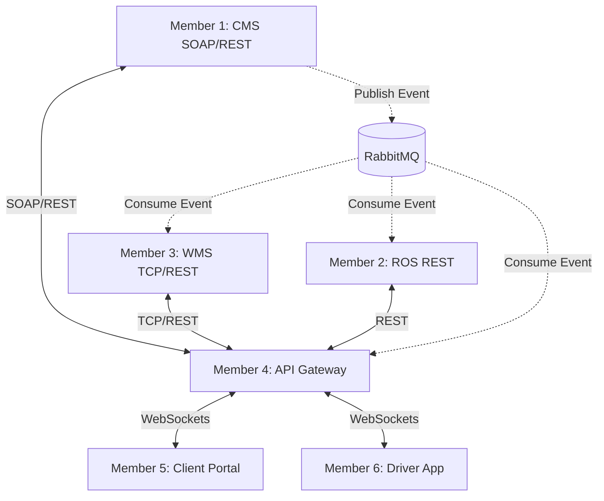

# SwiftTrack — Detailed Work Division & Integration Plan
### IS3208 | Assignment 4 | Group of 6

This document details the exact responsibilities of each of the 6 group members, what they must code, and the critical **overlaps (interfaces)** where they must coordinate.

---

## 1. Member-by-Member Work Breakdown



### Member 1: CMS Service (Legacy SOAP + REST + DB Insertion)
*   **Technologies:** Python, Flask, Spyne (SOAP), psycopg2 (PostgreSQL client), pika (RabbitMQ client).
*   **What you must implement:**
    *   **SOAP Interface (`/soap`):**
        *   `authenticate_client(email, password)`: Verifies client against database table `clients`.
        *   `create_order(...)`: Inserts an order into the `orders` database table, returns generated `order_id`.
    *   **REST Interface:**
        *   `POST /api/clients/auth`: Compares email/password with database.
        *   `POST /api/orders`: Inserts order, generates `transaction_id`, and publishes `ORDER_CREATED` event to RabbitMQ.
        *   `GET /api/orders/<client_id>`: Query orders from database.
        *   `PUT /api/orders/status/<order_id>`: Updates the order's status column.
    *   **RabbitMQ Publisher:**
        *   Publishes `ORDER_CREATED` message to RabbitMQ exchange/queue `order_events`.
    *   **Overlaps with:**
        *   **Member 6:** Must agree on the exact tables structure (`clients`, `orders`) in `init.sql`.
        *   **Member 4:** The gateway will proxy REST calls to your Flask endpoints. You must provide the REST API JSON schema.
        *   **Member 2 & 3:** Must use the exact JSON structure for the `ORDER_CREATED` event so ROS and WMS can parse it correctly.

---

### Member 2: ROS Service (Route Optimization & manifest management)
*   **Technologies:** Node.js, Express, `amqplib` (RabbitMQ client).
*   **What you must implement:**
    *   **In-Memory Storage:**
        *   Javascript Map storing vehicle routes and stop manifest details.
    *   **Optimization Logic:**
        *   A module using the **Haversine formula** to calculate distance between latitude/longitude points.
        *   A simple greedy routing function (nearest neighbor) to sort stops in a route and assign sequence numbers.
    *   **RabbitMQ Consumer:**
        *   Listen for `ORDER_CREATED` event.
        *   Add a delivery stop to a route, run route optimization, and update stop ETAs.
        *   Publish `ROS_PROCESSING_COMPLETE` event to `route_events` queue.
    *   **REST Endpoints:**
        *   `GET /api/routes/driver/:driverId/today`: Returns the ordered stop manifest.
        *   `PUT /api/routes/:routeId/stops/:orderId`: Update stop status (`pending`, `completed`, `failed`).
    *   **Overlaps with:**
        *   **Member 1:** Must match the coordinate fields (`pickup_lat`, `pickup_lng`, `delivery_lat`, `delivery_lng`) sent in the `ORDER_CREATED` event.
        *   **Member 4:** The gateway needs to forward driver requests to your route endpoints.
        *   **Member 6 (Driver App):** Must coordinate on the format of the manifest JSON (stops, coordinates, ETA times).

---

### Member 3: WMS Service (Warehouse TCP Server + REST Adapter)
*   **Technologies:** Python, Flask, `socket` module (TCP), `threading`, psycopg2, pika.
*   **What you must implement:**
    *   **TCP Server (Port 9000):**
        *   Listen for raw TCP socket connections.
        *   Read/write newline-delimited JSON commands: `{"type": "REGISTER_PACKAGE", "order_id": "..."}` or `{"type": "LOAD_TO_VEHICLE", "package_id": "..."}`.
    *   **RabbitMQ Consumer:**
        *   Listen for `ORDER_CREATED` event.
        *   Upon trigger, auto-register a package in the `packages` table, assign a barcode (e.g. string uuid) and a grid location (e.g., `Zone A, Shelf 3`).
        *   Publish `WMS_PROCESSING_COMPLETE` event to `wms_events` queue.
    *   **REST Endpoints:**
        *   `GET /api/packages/order/:orderId`: Retrieves package barcode & location.
        *   `PUT /api/packages/:packageId/status`: Changes status to `READY`, `LOADED`, etc.
    *   **Overlaps with:**
        *   **Member 4:** The gateway will establish direct TCP socket connections to your port 9000. You must document your TCP JSON protocol.
        *   **Member 6:** Must agree on the `packages` schema in PostgreSQL.

---

### Member 4: API Gateway (Authentication, Orchestrator & WS Server)
*   **Technologies:** Node.js, Express, `ws` (WebSockets), `jsonwebtoken`, `amqplib`, `net` (TCP client), `axios`.
*   **What you must implement:**
    *   **Reverse Proxy & Routing:**
        *   Proxy REST client routes to CMS (REST) and driver routes to ROS.
        *   Implement **Protocol Translation**: convert incoming REST payload for WMS into raw TCP socket JSON messages over port 9000.
    *   **JWT Middleware:**
        *   Generate signed JWTs for client/driver logins. Validate token in request headers (`Authorization: Bearer <token>`).
    *   **WebSocket Server:**
        *   Manage maps of active connections (`wsClients.clients` and `wsClients.drivers`).
        *   Map client connections to `client_id` and driver connections to `driver_id`.
    *   **Transaction Saga Monitor:**
        *   Maintain an in-memory `transactions` map.
        *   When an order is created, initialize tracking: `cms: completed`, `ros: pending`, `wms: pending`.
        *   Consume from RabbitMQ (`wms_events` and `route_events`). When events arrive, update the transaction step status.
        *   Notify client via WebSockets on changes. If any step fails, trigger a rollback notification (`transaction_failed`).
    *   **Overlaps with:**
        *   **Member 1, 2, 3:** You consume their RabbitMQ events and proxy HTTP/TCP requests to them. You are the glue.
        *   **Member 5 & 6 (Frontends):** Must agree on the WebSocket payload schema (event types, notifications structure).

---

### Member 5: Client Portal (Web Application)
*   **Technologies:** HTML, Vanilla CSS, Vanilla JavaScript, Nginx (Reverse Proxy).
*   **What you must implement:**
    *   **Login & Authentication UI:**
        *   Fetch credentials, query Gateway `/api/auth/client/login`, save JWT token to `localStorage`.
    *   **Order Intake Form:**
        *   Collect pickup/delivery details, dispatch to Gateway `POST /api/orders`.
    *   **Dashboard & Order Track:**
        *   Render client orders in a table with live status badges.
        *   Detailed lookup combining order data, package barcodes (from WMS), and driver ETA (from ROS).
    *   **WebSocket Client:**
        *   Maintain persistent WebSocket connection. When a message of type `notification` or `delivery_update` arrives, trigger UI notifications and update the table.
    *   **Nginx Configuration:**
        *   Configure Nginx server to route index file and reverse proxy `/api/*` and `/ws` to the API Gateway container.
    *   **Overlaps with:**
        *   **Member 4:** Must connect to the gateway websocket and make requests matching Gateway REST specs.

---

### Member 6: Driver App, DB Setup, and Docker Orchestration
*   **Technologies:** Docker, Docker Compose, PostgreSQL (SQL), HTML/CSS/JS (mobile layout), Nginx.
*   **What you must implement:**
    *   **Database Schema (`database/init.sql`):**
        *   Write PostgreSQL table definitions (`clients`, `drivers`, `orders`, `packages`, `routes`, `route_stops`, `transaction_logs`).
        *   Provide seed insert queries with demo accounts (hashed passwords using standard bcrypt).
    *   **Dockerization:**
        *   Write root `docker-compose.yml` defining networks, environment variables, healthchecks, and mounts.
    *   **Driver Mobile App Frontend:**
        *   Mobile-first design (single column, clean lists).
        *   Dashboard displaying assigned stops with coordinates.
        *   "Complete Delivery" window: HTML canvas signature pad capturing handwriting, converting it to base64, and POSTing to gateway.
        *   Dropdown to select failure reasons when marking delivery failed.
        *   WebSocket client to receive live notifications of route edits.
    *   **Overlaps with:**
        *   **Member 1, 3:** You setup the database they connect to.
        *   **Member 2:** You fetch driver route manifests from their ROS endpoints.
        *   **Member 4:** Driver app needs to send signature payload and connect to the gateway websocket.

---

## 2. Critical Overlap Points (The Interfaces)

To prevent code integration failures, the group must lock down these five interface definitions on Day 1:

### Overlap A: RabbitMQ Event Schemas
All events published to queues must strictly match this format:

```json
{
  "event_type": "ORDER_CREATED", // Or ROS_PROCESSING_COMPLETE, WMS_PROCESSING_COMPLETE
  "timestamp": "2026-07-31T11:47:45Z",
  "data": {
    "order_id": "ORD00123",
    "transaction_id": "TXN9A8B7C",
    "client_id": "CLT001",
    "pickup_address": "123 Tech Street, Colombo",
    "delivery_address": "456 Style Avenue, Kandy",
    "pickup_lat": 6.9271,
    "pickup_lng": 79.8612,
    "delivery_lat": 7.2906,
    "delivery_lng": 80.6337,
    "weight": 2.5
  }
}
```

### Overlap B: Gateway to WMS TCP Protocol
When Member 4 (Gateway) talks to Member 3 (WMS) over TCP (Port 9000), they communicate using newline-terminated JSON:

*   **Request from Gateway:**
    ```json
    {"command": "SCAN_BARCODE", "barcode": "PKG-98765-ABC"}\n
    ```
*   **Response from WMS:**
    ```json
    {"success": true, "status": "LOADED", "package_id": "PKG012", "location": "A3-2"}\n
    ```

### Overlap C: WebSocket Event Schemas
Websocket messages broadcasted from Gateway to Client Portal / Driver App:

```json
{
  "type": "notification",
  "source": "wms", // or "route", "cms"
  "event_type": "PACKAGE_STATUS_UPDATED",
  "data": {
    "order_id": "ORD00123",
    "status": "READY_FOR_PICKUP"
  },
  "timestamp": "2026-07-31T11:47:45Z"
}
```

### Overlap D: DB Column names
CMS and WMS must use exact table and column names matching Member 6's SQL schema (e.g. `client_id` vs `clientId`, `order_id` vs `orderId`).

---

## 3. Verification Plan

### Milestone 1: Core Flow Testing
Once Members 1, 2, 3, and 6 finish their service code:
1. Fire up postgres and rabbitmq containers.
2. Manually trigger order creation endpoint in CMS via Postman/cURL.
3. Check RabbitMQ manager console (`localhost:15672`) to see if `ORDER_CREATED` event is populated.
4. Verify that ROS consumes the event, optimizes route, and WMS registers the package location in Postgres.

### Milestone 2: Gateway Integration
Once Member 4 integrates the gateway:
1. Test client/driver login flow. Check if JWT validation blocks unauthorized endpoints.
2. Test protocol bridge: Make a REST API call to Gateway targeting a package barcode scan, verify Gateway successfully communicates over TCP to WMS, retrieves data, and converts it back to HTTP response.

### Milestone 3: UI E2E Walkthrough
Once Member 5 and 6 finish frontends:
1. Log in as Client -> Submit Order -> Confirm live WebSocket toast notification appears on dashboard.
2. Log in as Driver -> Verify new order shows up in the optimised delivery list.
3. Driver completes delivery, draws signature on pad -> Click Submit.
4. Verify Client dashboard automatically updates the order status to `delivered` in real-time.
